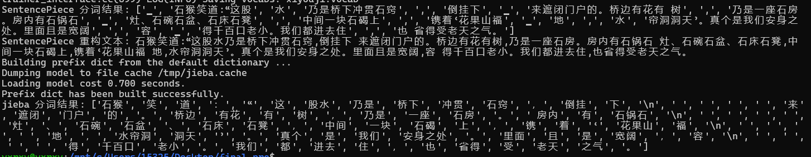
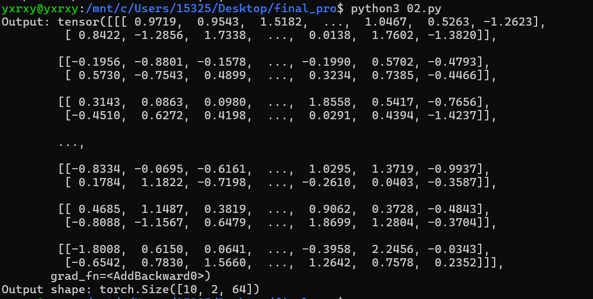

# Transformer 实现

## 项目简介
实现了 Transformer 相关的核心算法和组件。

## 任务完成清单
- [x] WordPiece 分词算法实现
  - 实现了基于 BPE 的词表构建
  - 支持中英文分词
  - 包含特殊标记处理

- [x] Transformer 核心组件实现
  - Position Encoding（位置编码）
  - Multi-Head Attention（多头注意力机制）
  - Feed Forward Network（前馈神经网络）
  - Layer Normalization（层归一化）

  
  
  